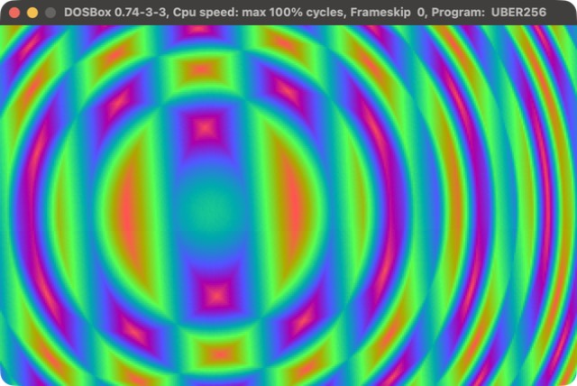

# MOIRE

**A 131-byte DOS demo: two ring families, one orbiting the other, XORed into a swirling moire.**

[](https://github.com/djayuffe/uber256-dos-intro/actions/workflows/ci.yml)



131 bytes (class 256) of x86 assembly: two sets of concentric rings, one orbiting the other, combined with XOR into a hypnotic interference pattern, under a dense rolling rainbow palette.

| | |
|---|---|
| Size | **131 bytes** (class 256; a build gate stops it growing back) |
| CPU | 386+ (real mode) |
| Video | VGA mode 13h, 320x200x256, paced to vertical retrace |
| Audio | none |

## Run it

Download `MOIRE.COM` from the [latest release](../../releases/latest) and run it in DOSBox
(`mount c .`, `c:`, `MOIRE.COM`), or build it:

```sh
./build.sh        # NASM build + size gates
./run-dosbox.sh   # run it in DOSBox
```

Needs [NASM](https://www.nasm.us/) and [DOSBox](https://www.dosbox.com/)
(macOS: `brew install nasm` and `brew install --cask dosbox`).

**Esc** exits.

## How it works

DOS enters a `.COM` with `AX = 0` and `BX = 0`, so `mov al,13h` is a complete mode set and `BL` is a
ready-made palette index and frame counter. The VGA BIOS leaves the DAC write index at 0 after a mode
set, so the palette is simply streamed to port `3C9h` with no index setup, and the DAC keeps only 6 bits,
so `R = i, G = 2i, B = 4i` (one running value, two doublings) is a whole dense, saturated 256-colour
palette in 12 bytes. Esc is read straight from port `60h`; the frame is paced by one short wait for
vertical retrace.

- **No loop nest**: `DI` runs over the whole 64 KB segment and wraps to 0 by itself, which ends the frame;
  x and y come from one `DIV` by 320 (`AX = y`, `DX = x`).
- **No square roots**: `r^2 = dx^2 + dy^2` per ring family, shifted right by 7. The two families are
  combined with **XOR**: a *sum* of two squared distances is just one bigger circle (about the midpoint), so
  it is the XOR that makes the interference pattern.
- **No sine table**: the second centre orbits on two triangle waves a quarter turn apart. `|signed byte|` is
  `CBW` / `XOR AL,AH` (3 bytes).
- **Cheaper squares**: `y - 100` fits a signed byte, so `SUB AL` / `IMUL AL` squares it in 4 bytes.
- **No stored counter**: the frame counter lives in the memory just past the end of the file.

The first version of this demo was 196 bytes (a 43-byte triangle-wave palette, a two-step ring fold, an
explicit orbit); this one is 131 and about as busy as a moire should be.

## Testing

`tests/run_tests.sh` runs the real binary in an emulated 16-bit CPU (Unicorn), entered the way DOS enters
a `.COM`. It checks the size gates, that it enters mode 13h and restores text mode, that palette entry `i` is
`(i, 2i, 4i)` in the DAC's 6 bits for all 256 entries from index 0, that it fills and animates a full
320x200 page every frame, that it exits on Esc with a balanced stack, and that it never touches memory
outside its segment. CI runs it on every push; a `vX.Y.Z` tag publishes a release.

## Related

Part of a small family of DOS size-coding demos, each in its own repository:
[uber10-dos-demo](https://github.com/djayuffe/uber10-dos-demo) (10 bytes),
[uber128-dos-demo](https://github.com/djayuffe/uber128-dos-demo) (77 bytes),
[uber256-rotozoomer](https://github.com/djayuffe/uber256-rotozoomer) (171 bytes),
[uber256-dos-intro](https://github.com/djayuffe/uber256-dos-intro) (131 bytes), and the big one,
[uber40k-dos-demo](https://github.com/djayuffe/uber40k-dos-demo) (a 20-scene show with a 3D engine and
Sound Blaster music). The index is [uber-tiny-demos](https://github.com/djayuffe/uber-tiny-demos).

## License

MIT
